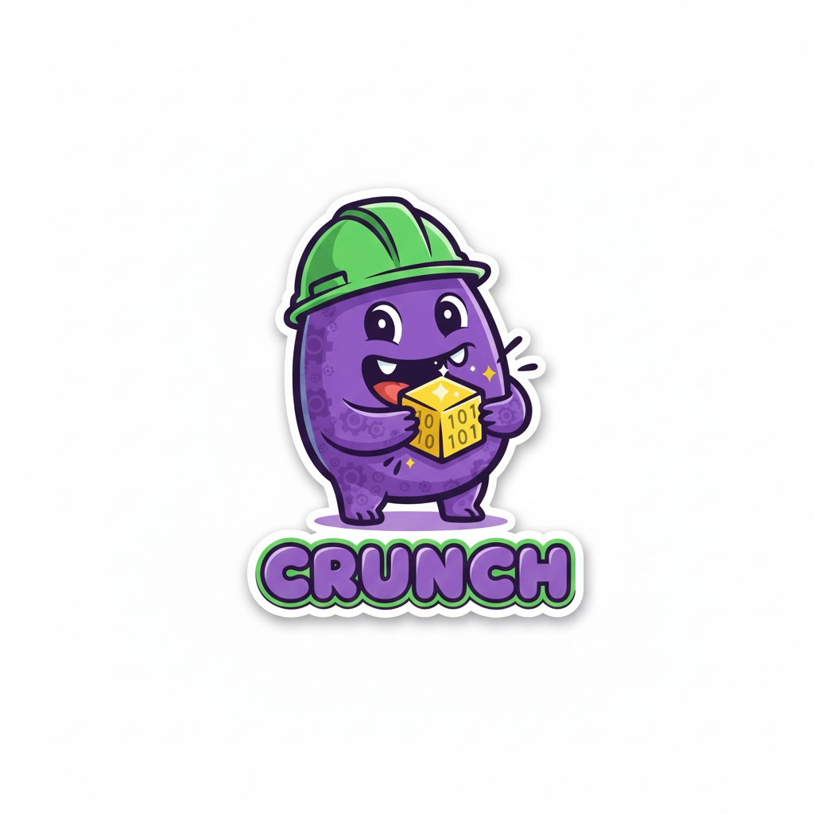

# Crunch



**Crunch** is a C++ message definition and serialization framework for mission-critical, resource-constrained systems where message semantics matter as much as structure.

See the [Doxygen](https://sam-w-yellin.github.io/crunch/) for API reference and detailed documentation.

## Key Features

- **Opt-out validation:** Semantic field and cross-field validation are first-class, built-in, and happen by default.
- **Static memory allocation:** For use in resource-constrained systems.
- **Flexible serialization:** Swap serialization formats (e.g., TLV, static layout) without changing message definitions.
- **Built-in integrity checks:** Support for CRC16 or parity is built-in.
- **Zero exceptions:** Uses `std::expected` and `std::optional` for error handling to be compatible with real-time requirements.

## Dependencies

*Crunch* requires C++23 and uses some STL libraries. 

*None of the STL libraries used by Crunch perform dynamic memory allocation.*

## Installation

Crunch is a header-only library. You can vendor it directly or use a build system.

### Vendoring

Copy the `include/` directory to your project:

```bash
cp -r crunch/include/ your_project/vendor/
```

Then add the include path to your compiler:
```bash
g++ -I vendor -std=c++23 your_code.cpp
```

### CMake

Add Crunch as a subdirectory:

```cmake
add_subdirectory(vendor/crunch)
target_link_libraries(your_target PRIVATE Crunch::crunch)
```

### Bazel

Add the dependency to your `BUILD` file:

```python
cc_binary(
    name = "your_target",
    srcs = ["main.cpp"],
    deps = ["//include:crunch"],  # Or @crunch//include:crunch if external
)
```

## Quick Start

```cpp
#include <crunch/crunch.hpp>

using namespace Crunch;
using namespace Crunch::fields;
using namespace Crunch::messages;

struct SensorReading {
    CRUNCH_MESSAGE_FIELDS(temperature, humidity);
    static constexpr MessageId message_id = 1;

    // Temperature in Celsius, must be between -40 and 85
    Field<1, Required, Float32<InRange<-40.0, 85.0>>> temperature;
    
    // Humidity percentage, must be between 0 and 100
    Field<2, Required, Float32<InRange<0.0, 100.0>>> humidity;
    
    // Cross-field validation: high humidity requires moderate temperature
    constexpr auto Validate() const -> std::optional<Error> {
        if (*humidity.get() > 90.0f && *temperature.get() > 50.0f) {
            return Error::validation(2, "humidity > 90% invalid above 50C");
        }
        return std::nullopt;
    }
    
    bool operator==(const SensorReading&) const = default;
};

int main() {
    SensorReading msg;
    
    msg.temperature.set(23.5f);
    msg.humidity.set(65.0f);
    
    // Get a correctly-sized buffer for this message type
    auto buffer = GetBuffer<SensorReading, integrity::CRC16, serdes::PackedLayout>();
    
    // Serialize (validates fields AND cross-field logic, calculates and appends integrity check, then writes)
    if (auto err = Serialize(buffer, msg); err) {
        return 1;
    }
    
    // Deserialize into new object. Checks integrity and validates fields AND cross-field logic.
    SensorReading decoded;
    if (auto err = Deserialize(buffer, decoded); err) {
        return 1;
    }
    
    assert(msg == decoded);  // Round-trip successful
}
```

## Message Definition

Messages must define:
1. A unique `MessageId`
2. A `CRUNCH_MESSAGE_FIELDS` macro listing all fields
3. A `Validate` method returning `std::optional<Error>`
4. An `operator==` for equality comparison

### Supported Field Types

| Category | Types |
|----------|-------|
| Integers | `Int8`, `Int16`, `Int32`, `Int64`, `UInt8`, `UInt16`, `UInt32`, `UInt64` |
| Floats | `Float32`, `Float64` |
| Other | `Bool`, `String`, `Enum` |
| Aggregate | `Submessage`, `Array`, `Map` |

See [Field Types](docs/field_types.md) for detailed examples of each type.

### Validation Flow

When serializing or deserializing, validation occurs in order:
1. **Field Presence**: Checks that all `Required` fields are set.
2. **Field Values**: Checks that set fields satisfy their validators.
3. **Message Logic**: Executes the user-defined `Validate()` method.

Validation can be bypassed using `SerializeWithoutValidation`.

## Serialization

Crunch supports pluggable serialization:
- `serdes::StaticLayout<Alignment>` - Deterministic, fixed-size binary format
- `serdes::TlvLayout` - Tag-Length-Value format for flexibility

See [Serialization Formats](docs/serialization.md) for wire format details.

## Roadmap

**Done:**
- Basic message definitions, field/message validation
- Scalar fields, enums, strings, submessages, arrays, maps
- Static layout and TLV serialization
- CRC16 and parity integrity checking
- Unit testing, documentation, CI/CD

**Upcoming:**
- Test coverage reporting
- QEMU-based cross-platform testing
- Fuzz testing
- Performance benchmarks
- C, Rust, Python bindings

Follow along at [volatileint.dev](https://volatileint.dev) for roadmap updates!
